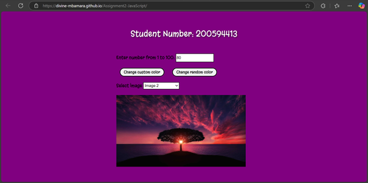

# Creating an Image Gallery 
### DESCRIPTION 
Create your own HTML, CSS, and JavaScript files, and develop an image gallery to retrieve 
images from images folder.

### LIVE DEMO
You can view the live version of the project here: [Live Demo](https://divine-mbamara.github.io/Assignment2-JavaScript/)

### PROJECT PREVIEW

### INSTRUCTIONS 
1. Create an html file (index.html) and two folders which contain css and javascript for the 
assignment. Or download the zip file to get a starting point.
 
2. Download the img folder and move to your working directory. Or you can use your own 
images to display.

3. Use the skeleton of the html file provided to be used in your file.
 
4. Follow the comments for help in the scripts.js file or create your own js.
   
5. The JavaScript and css file is not linked to the html. You will have to do that yourself. Don’t 
forget to use defer if you are adding script in the head section.

6. When “Change custom color” button is pressed, your student id should be displayed in the p 
tag. The background color of the page should also be changed based on the following conditions: 
  - If user’s input is less that 0 or more than 100 – red color 
  - If user's input is between 0 and 20 - green color 
  - If user's input is between 20 and 40 - blue color 
  - If user's input is between 40 and 60 - orange color 
  - If user's input is between 60 and 80 - purple color 
  - If user's input is between 80 and 100 - yellow color

7. When “Change random colour” button is pressed, a random between 1-100 should be 
generated and the background color should be changed based on the above conditions.

8. When the select tag is pressed, it should generate the options for the image names. The image 
src location should be stored in an array. Use the loop to go through the array items to create the 
options.

9. When the select list item is changed, it should display an image from the img folder.

10. Once you’ve completed the functionality of the interface, add some CSS to make the page 
visually attractive (don’t spend too much time on this – the focus is the JS).
